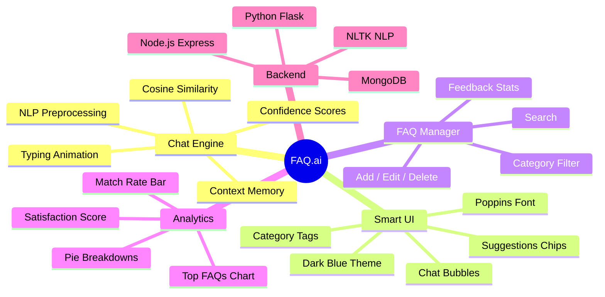
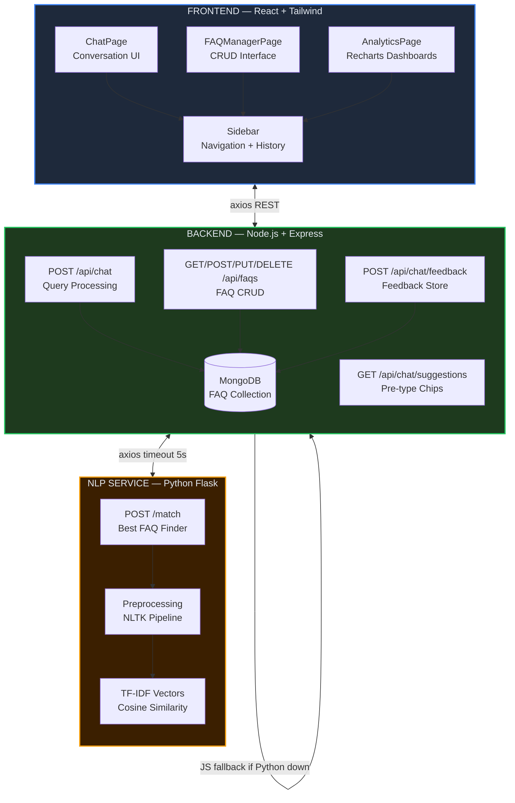
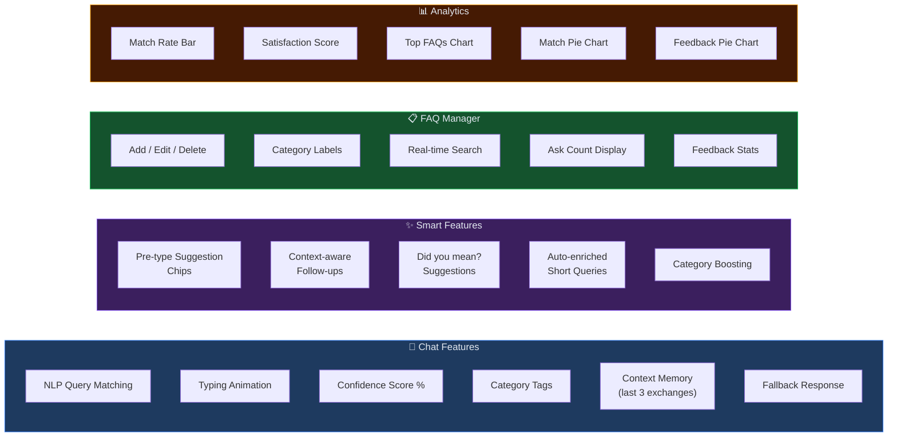
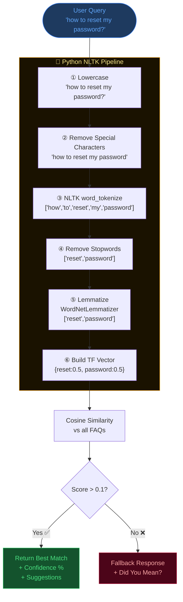
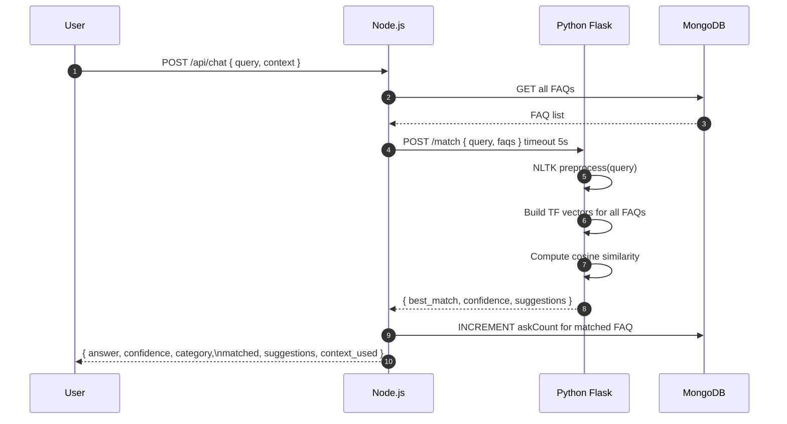
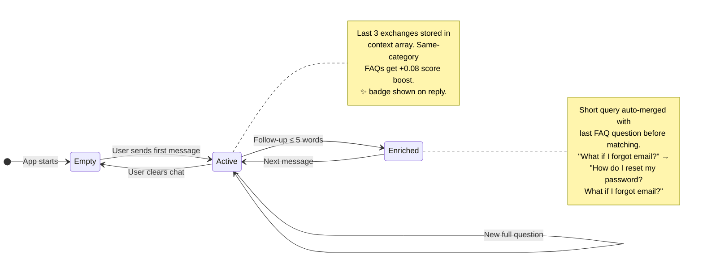
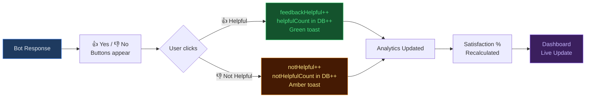
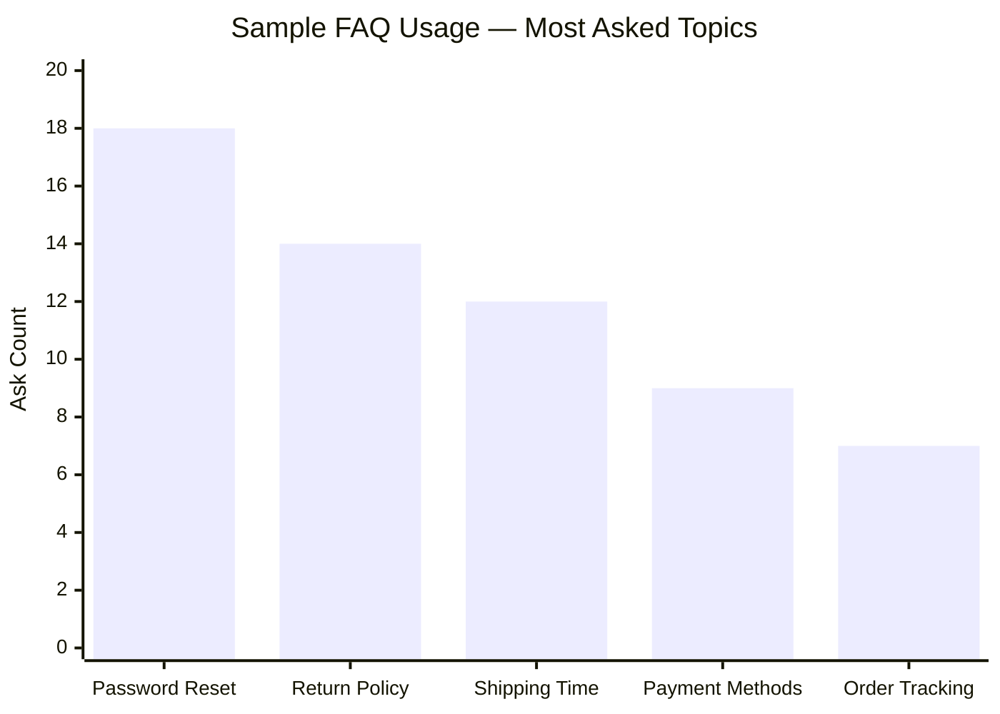
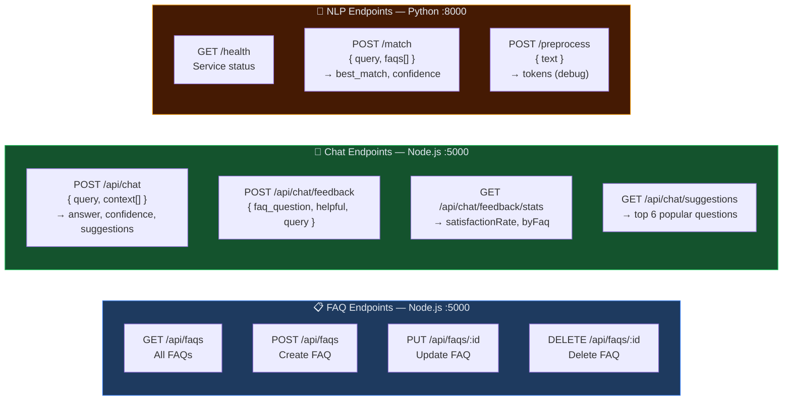
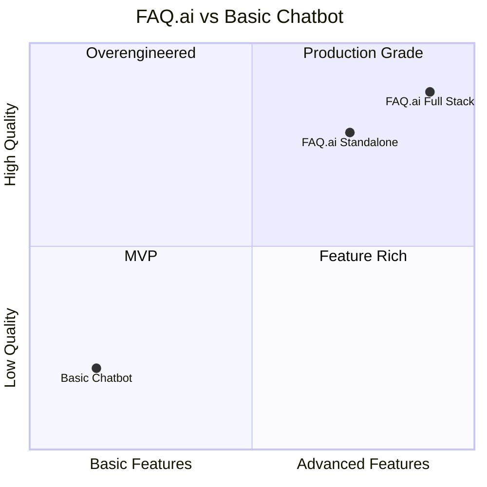

<div align="center">


<br/>

<!-- FAQ.ai Logo — GitHub compatible -->


<br/>


<br/>

# FAQ.ai — AI-Powered FAQ Chatbot Dashboard

**Production-level intelligent FAQ chatbot with context awareness, NLP matching,**  
**real-time feedback system, and analytics dashboard.**

<br/>

<!-- Tech stack badges -->


<br/><br/>


<br/>

</div>

---

## Table of Contents

- [Project Overview](#project-overview)
- [System Architecture](#system-architecture)
- [Tech Stack](#tech-stack)
- [Features](#features)
- [NLP Pipeline](#nlp-pipeline)
- [Context Awareness System](#context-awareness-system)
- [Feedback System](#feedback-system)
- [Analytics Dashboard](#analytics-dashboard)
- [File Structure](#file-structure)
- [Setup Instructions](#setup-instructions)
- [API Reference](#api-reference)
- [FAQ Dataset](#faq-dataset)
- [Screenshots](#screenshots)

---

## Project Overview

FAQ.ai is a production-level intelligent FAQ chatbot dashboard built as **Task 2** of the CodeAlpha AI Internship. It goes far beyond a basic chatbot — featuring NLP-powered matching, conversation context memory, smart pre-type suggestions, user feedback collection, and a full analytics dashboard.



---

## System Architecture



---

## Tech Stack

<div align="center">

<!-- Tech stack SVG cards -->
<svg width="760" height="90" viewBox="0 0 760 90" xmlns="http://www.w3.org/2000/svg">
  <defs>
    <linearGradient id="cardBg" x1="0%" y1="0%" x2="0%" y2="100%">
      <stop offset="0%" stop-color="#1e293b"/>
      <stop offset="100%" stop-color="#0f172a"/>
    </linearGradient>
    <linearGradient id="blue3d" x1="0%" y1="0%" x2="0%" y2="100%">
      <stop offset="0%" stop-color="#60a5fa"/>
      <stop offset="100%" stop-color="#1d4ed8"/>
    </linearGradient>
    <linearGradient id="green3d" x1="0%" y1="0%" x2="0%" y2="100%">
      <stop offset="0%" stop-color="#4ade80"/>
      <stop offset="100%" stop-color="#15803d"/>
    </linearGradient>
    <linearGradient id="yellow3d" x1="0%" y1="0%" x2="0%" y2="100%">
      <stop offset="0%" stop-color="#fde68a"/>
      <stop offset="100%" stop-color="#d97706"/>
    </linearGradient>
    <linearGradient id="purple3d" x1="0%" y1="0%" x2="0%" y2="100%">
      <stop offset="0%" stop-color="#c4b5fd"/>
      <stop offset="100%" stop-color="#6d28d9"/>
    </linearGradient>
    <linearGradient id="teal3d" x1="0%" y1="0%" x2="0%" y2="100%">
      <stop offset="0%" stop-color="#67e8f9"/>
      <stop offset="100%" stop-color="#0e7490"/>
    </linearGradient>
    <filter id="card-shadow">
      <feDropShadow dx="0" dy="4" stdDeviation="6" flood-color="#000" flood-opacity="0.5"/>
    </filter>
  </defs>

  <!-- React -->
  <rect x="4" y="8" width="134" height="74" rx="10" fill="url(#cardBg)" filter="url(#card-shadow)" stroke="#1d4ed8" stroke-width="1"/>
  <circle cx="34" cy="35" r="14" fill="url(#blue3d)"/>
  <text x="34" y="40" text-anchor="middle" font-family="monospace" font-size="10" font-weight="bold" fill="white">Re</text>
  <text x="58" y="33" font-family="monospace" font-size="11" font-weight="700" fill="#60a5fa">React 18</text>
  <text x="58" y="48" font-family="monospace" font-size="9" fill="#64748b">Tailwind CSS</text>
  <text x="58" y="63" font-family="monospace" font-size="8" fill="#475569">Recharts</text>

  <!-- Node.js -->
  <rect x="148" y="8" width="134" height="74" rx="10" fill="url(#cardBg)" filter="url(#card-shadow)" stroke="#15803d" stroke-width="1"/>
  <circle cx="178" cy="35" r="14" fill="url(#green3d)"/>
  <text x="178" y="40" text-anchor="middle" font-family="monospace" font-size="9" font-weight="bold" fill="white">Nd</text>
  <text x="202" y="33" font-family="monospace" font-size="11" font-weight="700" fill="#4ade80">Node.js</text>
  <text x="202" y="48" font-family="monospace" font-size="9" fill="#64748b">Express 4.18</text>
  <text x="202" y="63" font-family="monospace" font-size="8" fill="#475569">REST API</text>

  <!-- Python -->
  <rect x="292" y="8" width="134" height="74" rx="10" fill="url(#cardBg)" filter="url(#card-shadow)" stroke="#d97706" stroke-width="1"/>
  <circle cx="322" cy="35" r="14" fill="url(#yellow3d)"/>
  <text x="322" y="40" text-anchor="middle" font-family="monospace" font-size="10" font-weight="bold" fill="white">Py</text>
  <text x="346" y="33" font-family="monospace" font-size="11" font-weight="700" fill="#fde68a">Python Flask</text>
  <text x="346" y="48" font-family="monospace" font-size="9" fill="#64748b">NLTK 3.8</text>
  <text x="346" y="63" font-family="monospace" font-size="8" fill="#475569">NLP Service</text>

  <!-- MongoDB -->
  <rect x="436" y="8" width="134" height="74" rx="10" fill="url(#cardBg)" filter="url(#card-shadow)" stroke="#6d28d9" stroke-width="1"/>
  <circle cx="466" cy="35" r="14" fill="url(#purple3d)"/>
  <text x="466" y="40" text-anchor="middle" font-family="monospace" font-size="9" font-weight="bold" fill="white">Mg</text>
  <text x="490" y="33" font-family="monospace" font-size="11" font-weight="700" fill="#c4b5fd">MongoDB</text>
  <text x="490" y="48" font-family="monospace" font-size="9" fill="#64748b">Mongoose 7</text>
  <text x="490" y="63" font-family="monospace" font-size="8" fill="#475569">FAQ Storage</text>

  <!-- NLTK NLP -->
  <rect x="580" y="8" width="176" height="74" rx="10" fill="url(#cardBg)" filter="url(#card-shadow)" stroke="#0e7490" stroke-width="1"/>
  <circle cx="610" cy="35" r="14" fill="url(#teal3d)"/>
  <text x="610" y="40" text-anchor="middle" font-family="monospace" font-size="9" font-weight="bold" fill="white">NLP</text>
  <text x="634" y="33" font-family="monospace" font-size="11" font-weight="700" fill="#67e8f9">Cosine Sim</text>
  <text x="634" y="48" font-family="monospace" font-size="9" fill="#64748b">TF-IDF Vectors</text>
  <text x="634" y="63" font-family="monospace" font-size="8" fill="#475569">Lemmatization</text>
</svg>

</div>

| Layer | Technology | Version | Purpose |
|:---:|:---|:---:|:---|
| 🎨 **Frontend** | React + Tailwind CSS | 18.2 | Dashboard UI, chat interface |
| 🟢 **Backend** | Node.js + Express | 4.18 | REST API, FAQ CRUD, routing |
| 🐍 **NLP Service** | Python + Flask + NLTK | 3.8 | Text preprocessing + matching |
| 🗄️ **Database** | MongoDB + Mongoose | 7.4 | FAQ storage, feedback, history |
| 📊 **Charts** | Recharts | 2.7 | Analytics visualizations |
| 🧠 **Algorithm** | TF-IDF Cosine Similarity | — | FAQ matching engine |
| ✍️ **Font** | Poppins | — | Professional typography |
| 🎭 **Animations** | Framer Motion | 10.x | Smooth UI transitions |

---

## Features



---

## NLP Pipeline



### Algorithm Detail



---

## Context Awareness System



**Example conversation flow:**

```
User:  "How do I reset my password?"
Bot:   [Matches password reset FAQ — 87% confidence] ✅

User:  "What if I forgot email?"          ← only 5 words
Bot:   ✨ Context-aware reply
       [Enriched to "reset password + forgot email"]
       [Finds "What if I forgot my email too?" FAQ]
```

---

## Feedback System



---

## Analytics Dashboard



| Metric | Description | Visual |
|:---:|:---|:---:|
| 📈 **Total Queries** | All chat messages sent this session | Stat card |
| ✅ **Matched** | Queries with confidence > 10% | Stat card |
| ⚡ **Avg Confidence** | Mean cosine similarity score | Stat card |
| 😊 **Satisfaction** | % of 👍 feedback out of total | Stat card + bar |
| 📊 **Match Rate** | Matched / Total × 100 | Progress bar |
| 🏆 **Top FAQs** | Most asked questions | Horizontal bar chart |
| 🥧 **Match Pie** | Matched vs Unmatched | Mini pie |
| 💬 **Feedback Pie** | Helpful vs Not Helpful | Mini pie |

---

## File Structure

```
faq-chatbot/
│
├── 📄 README.md
│
├── 🎨 frontend/                    ← React + Tailwind
│   ├── package.json
│   ├── tailwind.config.js
│   ├── public/
│   │   └── index.html
│   └── src/
│       ├── index.js
│       ├── index.css               ← Poppins + animations
│       ├── App.js                  ← Router + state management
│       ├── components/
│       │   └── Sidebar.js          ← Navigation + history
│       └── pages/
│           ├── ChatPage.js         ← Chat UI + context memory
│           ├── FAQManagerPage.js   ← CRUD interface
│           └── AnalyticsPage.js    ← Recharts dashboard
│
├── 🟢 backend/                     ← Node.js + Express
│   ├── package.json
│   ├── .env                        ← MONGO_URI, PORT, NLP_URL
│   ├── server.js                   ← Express app entry
│   ├── models/
│   │   └── FAQ.js                  ← Mongoose schema
│   └── routes/
│       ├── faqs.js                 ← GET/POST/PUT/DELETE /api/faqs
│       └── chat.js                 ← POST /api/chat + feedback
│
├── 🐍 nlp/                         ← Python Flask NLP
│   ├── requirements.txt
│   └── app.py                      ← NLTK pipeline + /match endpoint
│
└── 📦 faq-chatbot-standalone.html  ← Zero-setup demo (open in browser)
```

---

## Setup Instructions

### Option A — Standalone (Zero Setup)

```bash
# Just double-click this file — opens in any browser instantly
faq-chatbot-standalone.html
```

> ✅ No Node, no Python, no MongoDB needed. Full NLP runs in-browser via JS cosine similarity.

---

### Option B — Full Stack

#### Prerequisites
- Node.js v18+
- Python 3.9+
- MongoDB (optional — fallback data used if unavailable)

#### Step 1 — Python NLP Service

```bash
cd nlp
pip install -r requirements.txt
python app.py
# → http://localhost:8000
```

#### Step 2 — Node.js Backend

```bash
cd backend
npm install

# Edit .env
MONGO_URI=mongodb://localhost:27017/faqchatbot
PORT=5000
NLP_SERVICE_URL=http://localhost:8000

npm run dev
# → http://localhost:5000
```

#### Step 3 — React Frontend

```bash
cd frontend
npm install
npm start
# → http://localhost:3000
```

---

## API Reference



### Request / Response Examples

**POST /api/chat**
```json
// Request
{
  "query": "What if I forgot my email?",
  "context": [
    { "question": "How do I reset my password?", "answer": "...", "category": "Account" }
  ]
}

// Response
{
  "answer": "Contact support with your phone number or order ID...",
  "faq_question": "What if I forgot my email too?",
  "category": "Account",
  "confidence": 0.74,
  "matched": true,
  "suggestions": ["Is my personal data safe?", "How do I contact support?"],
  "context_used": true
}
```

---

## FAQ Dataset

Pre-loaded with **11 FAQs** across 6 categories:

| # | Question | Category | Color |
|:---:|:---|:---:|:---:|
| 1 | What is your return policy? | `Orders` | 🟢 |
| 2 | How do I reset my password? | `Account` | 🔵 |
| 3 | What if I forgot my email too? | `Account` | 🔵 |
| 4 | What payment methods do you accept? | `Payments` | 🟠 |
| 5 | How long does shipping take? | `Shipping` | 🟣 |
| 6 | Can I track my order? | `Orders` | 🟢 |
| 7 | How do I contact customer support? | `General` | ⚪ |
| 8 | Is my personal data safe? | `Technical` | 🔴 |
| 9 | Do you offer student discounts? | `General` | ⚪ |
| 10 | How do I cancel my order? | `Orders` | 🟢 |
| 11 | What is the refund timeline? | `Payments` | 🟠 |

---

## What Makes This Stand Out



| Feature | Basic Chatbot | FAQ.ai |
|:---|:---:|:---:|
| FAQ Matching | ✅ | ✅ |
| NLP Preprocessing | ❌ | ✅ NLTK |
| Context Memory | ❌ | ✅ Last 3 turns |
| Pre-type Suggestions | ❌ | ✅ 6 chips |
| Confidence Score | ❌ | ✅ % display |
| Category Tags | ❌ | ✅ Color coded |
| 👍 Feedback System | ❌ | ✅ With analytics |
| Analytics Dashboard | ❌ | ✅ Charts + stats |
| FAQ CRUD Manager | ❌ | ✅ Full |
| Fallback + Did You Mean? | ❌ | ✅ |
| Typing Animation | ❌ | ✅ |
| Professional UI | ❌ | ✅ Poppins + dark |

---

<div align="center">


<br/>

**Made with 💙 by Zara Alam**  

<br/>


</div>
